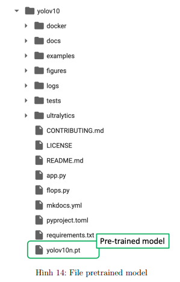
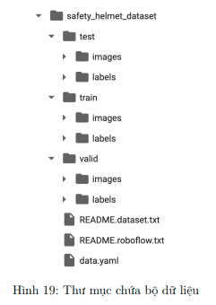

<!-- # helmet-safety-yolov10-PM01-AIO2024 -->
# Helmet Safety Project using YOLOv10 - AIO 2024

***Hướng dẫn dưới dây dùng Google Colab để thực thi***

## 1. Cài đặt pre-trained model
Sử dụng lệnh `!git clone https://github.com/THU-MIG/yolov10.git` để cài YOLOv10 từ github

Cài đặt các thư viện cần thiết: 
```
%cd yolov10
! pip install -q -r requirements . txt
! pip install -e .
```

Tải trọng số của pre-trained models: 
```
!wget https://github.com/THU-MIG/yolov10/releases/download/v1.1/yolov10n.pt
```

Sau khi tải xong thì sẽ có cấu trúc thư mục như sau: 


Khởi tạo mô hình: 
```
from ultralytics import YOLOv10

MODEL_PATH = 'yolov10n.pt'
model = YOLOv10 ( MODEL_PATH )
```

## 2. Tải bộ dữ liệu: 
***Có thể dùng bộ dữ liệu sau ([link dataset](https://drive.google.com/file/d/1twdtZEfcw4ghSZIiPDypJurZnNXzMO7R/view?usp=sharing)) hoặc tải lên bộ dữ liệu của cá nhân***

Tải và giải nén bộ dữ liệu mẫu
```
! gdown '1 twdtZEfcw4ghSZIiPDypJurZnNXzMO7R'
! mkdir safety_helmet_dataset
! unzip -q '/content/Safety_Helmet_Dataset.zip' -d './safety_helmet_dataset'
```
Đối với dữ liệu cá nhân, cần tuân thủ chứa các thư mục sau: 


## 3. Huấn luyện mô hình: 
```
YAML_PATH = '../safety_helmet_dataset/data.yaml'
EPOCHS = 50
IMG_SIZE = 640
BATCH_SIZE = 256

model.train (data = YAML_PATH,
epochs = EPOCHS,
batch = BATCH_SIZE,
imgsz = IMG_SIZE)
```

Có thể thay **YAML_PATH** bằng đường dẫn đến file **data.yaml** của dữ liệu cá nhân

Có thể thay đổi **BATCH_SIZE** theo $2^n$ (n &ge; 0)

## 4. Đánh giá mô hình: 
```
TRAINED_MODEL_PATH = 'runs/detect/train/weights/best.pt'
model = YOLOv10(TRAINED_MODEL_PATH)

model.val(data=YAML_PATH,
          imgsz=IMG_SIZE,
          split='test')
```